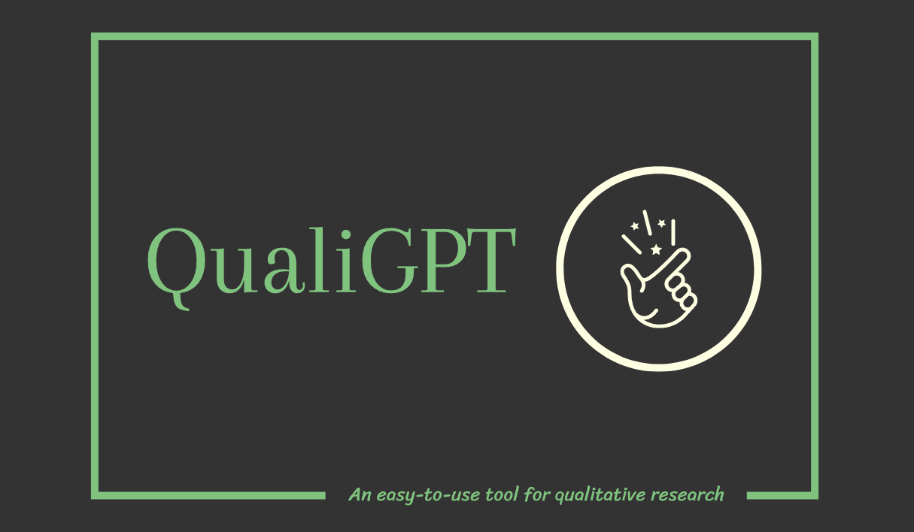
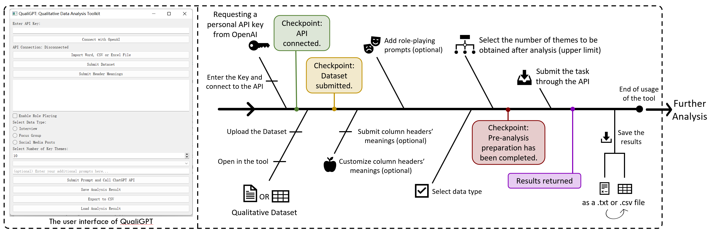

# **QualiGPT**
**QualiGPT: An easy-to-use tool for qualitative research (automatic coding)**  

-v0.1.0_alpha-brightgreen?logo=GitHub&link=https%3A%2F%2Fgithub.com%2FKindOPSTAR%2FQualiGPT%2Freleases%2Ftag%2FQualiGPTApp)

 

QualiGPT is a toolkit with a visual interactive interface based on the OpenAI API. It can assist qualitative analysts in quickly coding data from interviews, focus groups, or social media (posts or comments) stored in Word documents or spreadsheets (.xlsx or .csv). The results can be saved in .txt or .csv formats for easy and quick viewing.

Figure 1. Overview of the qualitative analysis toolkit, QualiGPT. The user interface of QualiGPT is displayed on the left. On the right side, the usage flow and design logic of QualiGPT are presented.

Before running, please check your Python environment and install the appropriate packages using  ` pip install` .
The list of required packages is as follows:
- `pip install nltk` 
- `pip install openai`
- `pip install PyQt5`
- `pip install python-docx`
- `pip install docx2txt`
- `pip install pandas`

## **QualiGPT-v0.1.0-alpha**
We have released the **[QualiGPT-v0.1.0-alpha](https://github.com/KindOPSTAR/QualiGPT/releases)** (Windows) version for testing. If you prefer not to build from the source code, please use [this](https://github.com/KindOPSTAR/QualiGPT/releases/tag/QualiGPTApp) version.

## **QualiGPT-v0.1.0-alpha Release Notes**
Click [here](https://github.com/KindOPSTAR/QualiGPT/releases/tag/QualiGPTApp) to read QualiGPT-v0.1.0-alpha Release Notes

## **QuickStart**
Please download `QualiGPT-v0.1.0-alpha.exe` from [Version Release](https://github.com/KindOPSTAR/QualiGPT/releases).

## **Source Code & Usage**
We have fully open-sourced the early version of this program, providing both .py and .ipynb files to build QualiGPT-v0.1.0-alpha. For a detailed description, please refer to the [Version Release](https://github.com/KindOPSTAR/QualiGPT/releases).

1. Please download the `QualiGPTApp.py` file from repository.
1. Navigate to the directory, for example, `cd ../QualiGPT` 
2. Install the required packages `pip install -r requirements.txt` (If you prefer not to use the `requirements.txt` file, you can manually install each package.)
3. Once you have installed all the packages required for this tool, please run (`python QualiGPTApp.py`) through the `command prompt` (cmd), or **(highly recommended)** compile from [VS Code](https://code.visualstudio.com/). If you are using [Jupyter Notebook](https://jupyter.org/), please convert `QualiGPTApp.py` to `QualiGPTApp.ipynb`. Please note that after each run, you'll need to restart the kernel to run it again.  

### How to get OpenAI API.

- Please register and log in to [OpenAI](https://openai.com/) to request your personal API key and keep it safe.

### User manual

Please follow the **user manual** to use QualiGPT.

Figure 2. User manual

## **Citation**
Please cite these papers in your publications if QualiGPT helps your research. The theoretical foundation for developing QualiGPT comes from: **[Redefining Qualitative Analysis in the AI Era: Utilizing ChatGPT for Efficient Thematic Analysis](https://arxiv.org/abs/2309.10771)**.

> @misc{zhang2023redefining,
      title={Redefining Qualitative Analysis in the AI Era: Utilizing ChatGPT for Efficient Thematic Analysis}, 
      author={He Zhang and Chuhao Wu and Jingyi Xie and Yao Lyu and Jie Cai and John M. Carroll},
      year={2023},
      eprint={2309.10771},
      archivePrefix={arXiv},
      primaryClass={cs.HC}
}

> @misc{zhang2023qualigpt,
      title={QualiGPT: GPT as an easy-to-use tool for qualitative coding}, 
      author={He Zhang and Chuhao Wu and Jingyi Xie and ChanMin Kim and John M. Carroll},
      year={2023},
      eprint={2310.07061},
      archivePrefix={arXiv},
      primaryClass={cs.HC}
}

## **License**
QualiGPT is freely available for use, and may be redistributed any content in this repository under the [Creative Commons Attribution 4.0 International Public License](https://creativecommons.org/licenses/by/4.0/legalcode) and the [MIT License](https://opensource.org/license/mit/). QualiGPT is freely available for academic and commercial use. We hope it benefits the research community and facilitates further advancements in the field. We encourage users to contribute and provide feedback to improve the tool.

## **Additional Notes**
This project is one of the works in a series of projects. To view the complete project, please visit the [LLMs x Generative AI Project](https://he-zhang.com/home/531-2/llmsxai/).
